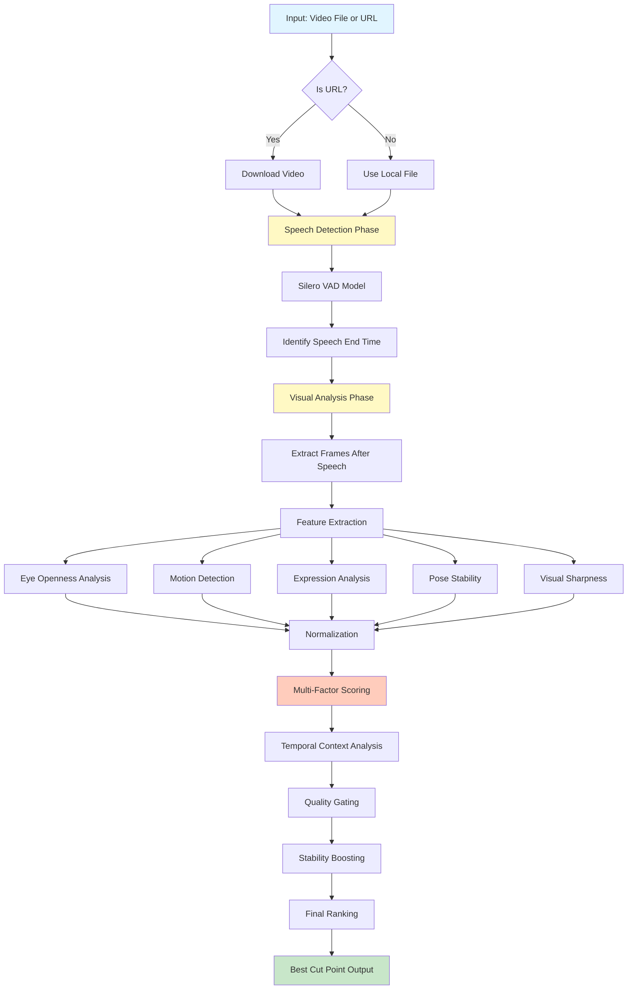

# SceneFlow: Technical Approach

## Table of Contents
1. [System Overview](#system-overview)
2. [Pipeline Architecture](#pipeline-architecture)
3. [Detailed Step-by-Step Process](#detailed-step-by-step-process)
4. [Technical Components](#technical-components)
5. [Scoring & Ranking System](#scoring--ranking-system)

---

## System Overview

**What does SceneFlow do?**

SceneFlow automatically finds the best point to cut AI-generated talking head videos. Instead of manually scrubbing through videos to find a natural-looking endpoint, SceneFlow analyzes the video and tells you exactly when to cut (e.g., "cut at 5.23 seconds").

**Why is this important?**

When creating AI-generated talking head videos (like for educational content, marketing, or social media), you often need to trim the end. Cutting at the wrong moment can result in:
- Cutting while the person is mid-speech (awkward!)
- Videos ending while the person is blinking
- Unstable motion at the endpoint
- Unnatural facial expressions frozen on screen

SceneFlow solves this by analyzing both **audio (speech detection)** and **visual features (facial analysis)** to find the perfect cut point.

---

## Pipeline Architecture



---

## Detailed Step-by-Step Process

### **Phase 1: Input Handling & Preparation**

#### Step 1: Input Processing
**Technical:** The system accepts either a local video file path or a URL. URLs are validated and downloaded using HTTP GET requests to a temporary directory.

**Simple Explanation:** You can give SceneFlow either a video file on your computer or a link to a video online. If it's a link, SceneFlow downloads it first.

**Code Location:** [`api.py`](src/sceneflow/api.py) - Functions `_is_url()`, `_download_video()`

---

### **Phase 2: Speech Detection** 🎤

#### Step 2: Load Audio for Analysis
**Technical:** The video's audio track is extracted and converted to a 16kHz mono audio signal using librosa. This is the standard format required by the Silero VAD model.

**Simple Explanation:** SceneFlow pulls out just the sound from the video and converts it to a format that the speech detector can understand (like converting a song to a specific audio quality).

**Code Location:** [`speech_detector.py`](src/sceneflow/speech_detector.py) - Method `_load_audio_for_vad()`

```python
# Extract audio at 16kHz sample rate (standard for VAD)
audio, sr = librosa.load(file_path, sr=16000, mono=True)
```

---

#### Step 3: Speech Timestamp Detection
**Technical:** Silero VAD, a deep learning-based Voice Activity Detection model, processes the audio to identify speech segments. The model outputs timestamps for when speech starts and ends. We take the END timestamp of the LAST speech segment as our starting point for visual analysis.

**Simple Explanation:** Think of this like a smart listener that can detect exactly when someone stops talking. It's not fooled by pauses or background noise - it knows when the actual speech ends. This gives us a starting point: "Don't cut before this time, because the person is still talking."

**Code Location:** [`speech_detector.py`](src/sceneflow/speech_detector.py) - Method `get_speech_end_time()`

**Algorithm:**
```python
# 1. Load Silero VAD model (pre-trained deep learning model)
vad_model = load_silero_vad()

# 2. Analyze audio to find speech segments
speech_timestamps = get_speech_timestamps(audio, vad_model, return_seconds=True)

# 3. Get the end time of the LAST speech segment
speech_end_time = speech_timestamps[-1]['end']  # e.g., 5.12 seconds
```

**Confidence Calculation:**
```python
# Longer final speech segments = higher confidence
segment_duration = last_segment['end'] - last_segment['start']
confidence = min(1.0, segment_duration / 0.5)  # Segments ≥0.5s = full confidence
```

---

### **Phase 3: Visual Feature Extraction** 👁️

Now that we know when speech ends, we analyze EVERY frame from that point until the video ends to find the best visual cut point.

#### Step 4: Frame Sampling
**Technical:** Frames are extracted from `speech_end_time` to `video_end_time`. To improve performance, we can sample every Nth frame (default: every 2nd frame) based on the `sample_rate` parameter.

**Simple Explanation:** We grab snapshots (frames) from the video starting from when speech ends. To save time, we might skip frames (like looking at every other frame instead of every single one).

**Code Location:** [`ranker.py`](src/sceneflow/ranker.py) - Method `_extract_features()`

```python
# Get frames between speech end and video end
start_frame = int(speech_end_time * fps)
end_frame = int(video_end_time * fps)

# Sample every Nth frame
for frame_idx in range(start_frame, end_frame, sample_rate):
    # Extract and analyze this frame
```

---

#### Step 5: Facial Landmark Detection
**Technical:** Each frame is processed using **InsightFace** with 106-point facial landmark detection. This provides precise locations for:
- 7 points per eye (14 total for both eyes)
- 20 points for the mouth outline
- Additional points for nose, eyebrows, face contour, etc.

**Simple Explanation:** For each snapshot, we identify the exact positions of facial features - like pinpointing where the corners of the eyes are, where the mouth is, etc. This is super detailed (106 points on the face!) so we can measure things very accurately.

**Code Location:** [`extractors.py`](src/sceneflow/extractors.py) - Class `FeatureExtractor`

**Landmark Indices:**
```python
LEFT_EYE_INDICES = list(range(35, 42))      # 7 points for left eye
RIGHT_EYE_INDICES = list(range(42, 49))     # 7 points for right eye
MOUTH_OUTER_INDICES = list(range(52, 72))   # 20 points for outer mouth
```

---

#### Step 6: Eye Aspect Ratio (EAR) Calculation
**Technical:** EAR is calculated using the formula:

```
EAR = (||p2-p6|| + ||p3-p5||) / (2 * ||p1-p4||)
```

Where p1-p6 are the 6 vertical/horizontal eye landmarks. Lower EAR indicates closed eyes (blinking).

**Simple Explanation:** We measure how "open" the eyes are by comparing the vertical distance between eyelids to the horizontal width of the eye. If someone is blinking or has eyes closed, this number is low. We want a natural eye openness - not too wide (surprised look) and not closed (blinking).

**Code Location:** [`extractors.py`](src/sceneflow/extractors.py) - Method `_calculate_ear()`

**Interpretation:**
- **< 0.2:** Eyes closing/blinking ❌ (BAD for cut points)
- **0.25-0.35:** Normal open eyes ✅ (BEST for cut points)
- **> 0.4:** Eyes wide open (surprised) ⚠️ (Okay, but not ideal)

```python
def _calculate_ear(self, eye_landmarks):
    # Vertical distances
    v1 = euclidean_distance(eye_landmarks[1], eye_landmarks[5])
    v2 = euclidean_distance(eye_landmarks[2], eye_landmarks[4])
    
    # Horizontal distance
    h = euclidean_distance(eye_landmarks[0], eye_landmarks[3])
    
    # EAR formula
    ear = (v1 + v2) / (2.0 * h)
    return ear
```

---

#### Step 7: Mouth Aspect Ratio (MAR) Calculation
**Technical:** MAR uses a similar formula to EAR but applied to mouth landmarks:

```
MAR = (||p2-p10|| + ||p4-p8||) / (2 * ||p0-p6||)
```

This measures mouth openness - a key component of expression analysis.

**Simple Explanation:** Just like with eyes, we measure how open the mouth is. A closed mouth (< 0.15) is best for cut points because it looks natural and calm. An open mouth (> 0.30) usually means the person is talking or about to talk - bad for cutting!

**Code Location:** [`extractors.py`](src/sceneflow/extractors.py) - Method `_calculate_mar()`

**Interpretation:**
- **< 0.15:** Closed mouth ✅ (BEST - looks calm and natural)
- **0.15-0.30:** Slightly open ⚠️ (Okay)
- **> 0.30:** Open mouth ❌ (Talking/yawning - AVOID)

---

#### Step 8: Motion Analysis (Optical Flow)
**Technical:** Farneback dense optical flow is computed between consecutive frames. This calculates motion vectors for every pixel, which are then aggregated to produce a motion magnitude score.

**Simple Explanation:** We compare two consecutive frames to see how much movement there is. This detects things like head movement, hand gestures, or body shifts. Low motion = stable frame = good cut point. High motion = unstable = bad cut point.

**Code Location:** [`extractors.py`](src/sceneflow/extractors.py) - Method `extract_motion_magnitude()`

```python
# Calculate optical flow between previous and current frame
flow = cv2.calcOpticalFlowFarneback(
    prev_gray, curr_gray,
    None, 0.5, 3, 15, 3, 5, 1.2, 0
)

# Calculate magnitude of motion vectors
magnitude = np.sqrt(flow[..., 0]**2 + flow[..., 1]**2)
motion_magnitude = np.mean(magnitude)
```

**Interpretation:**
- **< 0.5:** Very stable ✅ (BEST)
- **0.5-2.0:** Some movement ⚠️
- **> 2.0:** High motion ❌ (AVOID)

---

#### Step 9: Expression Activity Analysis
**Technical:** Expression activity is derived from multiple blendshape coefficients (smile, mouth movement, eyebrow position, etc.) and MAR. These are aggregated into a single metric representing how "active" or "neutral" the facial expression is.

**Simple Explanation:** We measure how much the person's face is expressing emotion or movement. A neutral, calm expression is best for cutting. If they're smiling big, talking, or showing strong emotion, that's less ideal.

**Code Location:** [`extractors.py`](src/sceneflow/extractors.py) - Method `_extract_single_face_expression()`

**Components:**
- Smile intensity
- Mouth movement (MAR)
- Eyebrow movement
- Overall facial activity

---

#### Step 10: Pose Stability Analysis
**Technical:** Face pose is estimated using the face bounding box dimensions and orientation. Deviation from a neutral, forward-facing pose is calculated. Additionally, center distance weighting is applied - faces closer to frame center receive higher importance.

**Simple Explanation:** We check if the person's head is in a stable, straight-on position or if they're turning/tilting. We also prefer when the face is centered in the frame rather than off to the side.

**Code Location:** [`extractors.py`](src/sceneflow/extractors.py) - Methods `_extract_single_face_pose()`, `_calculate_center_distance()`

**Factors:**
- Head rotation/tilt (yaw, pitch, roll)
- Face position in frame (centered vs. edge)
- Bounding box stability

---

#### Step 11: Visual Sharpness Assessment
**Technical:** Laplacian variance is used to measure frame sharpness. This detects blur, motion blur, or compression artifacts. Higher variance indicates sharper, clearer frames.

**Simple Explanation:** We check if the frame is sharp and clear or blurry. Blurry frames look bad as thumbnails or freeze-frames, so we prefer sharp ones.

**Code Location:** [`extractors.py`](src/sceneflow/extractors.py) - Method `extract_sharpness()`

```python
# Convert to grayscale
gray = cv2.cvtColor(frame, cv2.COLOR_BGR2GRAY)

# Calculate Laplacian variance (sharpness metric)
laplacian = cv2.Laplacian(gray, cv2.CV_64F)
sharpness = laplacian.var()
```

**Interpretation:**
- **Higher values:** Sharper, clearer frames ✅
- **Lower values:** Blurry or low-quality frames ❌

---

#### Step 12: Multi-Face Handling (When Multiple People Appear)
**Technical:** When multiple faces are detected, center-weighted averaging is used:

```python
weight = exp(-distance_from_center * strength)
final_metric = Σ(metric_i * weight_i) / Σ(weight_i)
```

Faces closer to the frame center have exponentially higher influence.

**Simple Explanation:** If there are multiple people in the frame, we focus more on the person in the center (usually the main subject) but still consider everyone. The person in the middle matters more than people on the edges.

**Code Location:** [`extractors.py`](src/sceneflow/extractors.py) - Methods `_aggregate_multi_face_metrics()`, `_calculate_center_weight()`

---

### **Phase 4: Normalization & Scoring** 📊

Now we have raw measurements for every frame. We need to convert these to scores and combine them intelligently.

#### Step 13: Metric Normalization
**Technical:** Different normalization strategies are applied based on metric type:

- **Eye Openness:** Gaussian normalization (rewards values near median)
- **Motion, Expression, Pose:** Inverse min-max normalization (lower = better)
- **Sharpness:** Standard min-max normalization (higher = better)

All normalized scores are in [0, 1] range.

**Simple Explanation:** We convert all our measurements to a standard 0-to-1 scale so we can compare apples to apples. For some metrics like motion, we flip them (less motion = higher score). For eye openness, we reward "normal" values most (not too open, not too closed).

**Code Location:** [`normalizer.py`](src/sceneflow/normalizer.py) - Class `MetricNormalizer`

**Normalization Types:**

| Metric | Type | Reason |
|--------|------|--------|
| Eye Openness | Gaussian (peak at median) | We want natural eye openness, not extremes |
| Motion Magnitude | Inverse Min-Max | Lower motion = better |
| Expression Activity | Inverse Min-Max | Less expression = more neutral = better |
| Pose Deviation | Inverse Min-Max | Less deviation = more stable = better |
| Visual Sharpness | Standard Min-Max | Higher sharpness = better |

**Example - Eye Openness Gaussian Normalization:**
```python
# Find median value (the "normal" eye openness)
target = np.median(eye_openness_values)
sigma = np.std(eye_openness_values)

# Score each frame - highest score at median, lower as we move away
for value in eye_openness_values:
    deviation = abs(value - target)
    score = exp(-(deviation ** 2) / (2 * sigma ** 2))
```

---

#### Step 14: Weighted Composite Scoring
**Technical:** Normalized scores are combined using configurable weights:

```python
composite_score = (
    0.30 * eye_openness_score +
    0.25 * motion_stability_score +
    0.20 * expression_neutrality_score +
    0.15 * pose_stability_score +
    0.10 * visual_sharpness_score
)
```

**Simple Explanation:** We combine all the individual scores into one "overall" score for each frame. Different factors have different importance - eyes matter most (30%), then motion (25%), then expression (20%), pose (15%), and sharpness (10%).

**Code Location:** [`scorer.py`](src/sceneflow/scorer.py) - Method `compute_scores()`

**Default Weights:**
- 🎯 **Eye Openness:** 30% - Most important! Blinking ruins cut points
- 🏃 **Motion Stability:** 25% - Motion at the end looks unprofessional
- 😐 **Expression Neutrality:** 20% - Neutral expressions look better frozen
- 📐 **Pose Stability:** 15% - Steady head position
- 🔍 **Visual Sharpness:** 10% - Nice to have, but less critical

These weights are fully customizable via `RankingConfig`.

---

#### Step 15: Temporal Context Window
**Technical:** A sliding window average is applied to composite scores:

```python
context_score[i] = mean(composite_scores[i-3:i+4])  # Window size = 7
```

This smooths out noise and rewards frames in stable sequences.

**Simple Explanation:** We don't just look at one frame in isolation. We look at a few frames before and after it and average their scores. This way, a frame that happens to be good but is surrounded by bad frames won't rank highly. We want a frame in a STABLE sequence.

**Code Location:** [`scorer.py`](src/sceneflow/scorer.py) - Method `_apply_context_window()`

**Visual Example:**
```
Frames:           [1] [2] [3] [4] [5] [6] [7] [8] [9]
Composite Scores: 0.5 0.6 0.8 0.9 0.8 0.7 0.6 0.4 0.3

For Frame [5] with window size 7:
  Window = [2, 3, 4, 5, 6, 7, 8]
  Context Score = mean(0.6, 0.8, 0.9, 0.8, 0.7, 0.6, 0.4) = 0.69
```

---

#### Step 16: Quality Gating (Penalty System)
**Technical:** Frames below a quality percentile threshold receive penalties:

```python
threshold = np.percentile(sharpness_values, 80)  # 80th percentile
if frame.sharpness < threshold:
    penalty = (threshold - frame.sharpness) / threshold
    quality_penalty = 1.0 - (penalty * 0.5)  # Up to 50% penalty
```

**Simple Explanation:** We punish frames that are in the bottom 20% for sharpness. If a frame is really blurry compared to others, its score gets reduced by up to 50%. This ensures we don't pick ugly frames even if other metrics are good.

**Code Location:** [`quality_gating.py`](src/sceneflow/quality_gating.py) - Class `QualityGate`

---

#### Step 17: Local Stability Boosting
**Technical:** Frames in locally stable sequences receive boosts:

```python
# Check if current frame and neighbors have low variance
if std(motion_in_window) < threshold:
    stability_boost = 1.2  # 20% boost
```

**Simple Explanation:** If a frame is part of a stable sequence (low motion for several frames in a row), we give it a bonus. This encourages cutting during calm, steady moments rather than brief flashes of stability.

**Code Location:** [`stability_analyzer.py`](src/sceneflow/stability_analyzer.py) - Class `StabilityAnalyzer`

---

#### Step 18: Final Score Calculation
**Technical:** The final score combines all components:

```python
final_score = context_score * quality_penalty * stability_boost
```

**Simple Explanation:** We multiply the three key numbers together:
- **Context score** (how good is this frame and its neighbors?)
- **Quality penalty** (is this frame sharp enough?)
- **Stability boost** (is this frame in a stable sequence?)

The result is the final score. Higher = better cut point.

**Code Location:** [`scorer.py`](src/sceneflow/scorer.py) - Method `compute_scores()`

---

### **Phase 5: Ranking & Selection** 🏆

#### Step 19: Frame Ranking
**Technical:** All frames are sorted by `final_score` in descending order. The frame with the highest score is the best cut point.

**Simple Explanation:** We line up all the frames from best to worst based on their final scores. The winner is our recommended cut point!

**Code Location:** [`ranker.py`](src/sceneflow/ranker.py) - Method `rank_frames()`

```python
# Sort frames by final score (highest first)
ranked_frames = sorted(frame_scores, key=lambda x: x.final_score, reverse=True)

# Best cut point is the top-ranked frame
best_cut_point = ranked_frames[0]
```

---

#### Step 20: Optional LLM-Based Selection
**Technical:** When enabled (`use_llm_selection=True`), the top N candidate frames are sent to an LLM (OpenAI GPT-4 Vision) with visual context. The LLM reviews frame images and selects the most natural-looking cut point.

**Simple Explanation:** Optionally, we can show the top few candidates to an AI that "sees" images (like GPT-4 with vision). It picks the one that looks most natural to human eyes. This adds an extra layer of intelligence beyond just the numbers.

**Code Location:** [`llm_selector.py`](src/sceneflow/llm_selector.py) - Class `LLMFrameSelector`

---

#### Step 21: Output Generation
**Technical:** The system can output:
- **Default:** Just the timestamp (`5.23`)
- **Verbose:** Detailed analysis with top N candidates
- **JSON:** Complete data including all scores, features, and metadata
- **Frames:** Annotated images with facial landmarks drawn
- **Video:** Cut video from start to the best cut point

**Simple Explanation:** You get back the cut time. You can also ask for more details like the top 5 candidates, save debug images showing what features were detected, or even save a pre-cut version of the video.

**Code Location:** [`api.py`](src/sceneflow/api.py), [`cli.py`](src/sceneflow/cli.py)

---

### **Phase 6: Cleanup** 🧹

#### Step 22: Resource Cleanup
**Technical:** If the video was downloaded from a URL, the temporary file and directory are deleted to free disk space.

**Simple Explanation:** If we downloaded a video, we clean up after ourselves by deleting the temporary file.

**Code Location:** [`api.py`](src/sceneflow/api.py) - Function `_cleanup_downloaded_video()`

---

## Technical Components

### 1. **Speech Detection Module**
- **Model:** Silero VAD (Voice Activity Detection)
- **Input:** 16kHz mono audio
- **Output:** Speech end timestamp + confidence
- **Accuracy:** Deep learning-based, highly accurate for speech/silence detection

### 2. **Feature Extraction Module**
- **Model:** InsightFace with 106-point landmark detection
- **Capabilities:**
  - Multi-face detection and tracking
  - Eye Aspect Ratio (EAR) calculation
  - Mouth Aspect Ratio (MAR) calculation
  - Pose estimation
  - Expression analysis
- **Performance:** Optimized for real-time processing

### 3. **Motion Analysis Module**
- **Algorithm:** Farneback Dense Optical Flow
- **Measures:** Pixel-level motion between frames
- **Output:** Motion magnitude (lower = more stable)

### 4. **Scoring System**
- **Normalization:** Multiple strategies (Gaussian, Min-Max, Robust, Sigmoid, etc.)
- **Weighting:** Configurable multi-factor weighted scoring
- **Temporal:** Context window smoothing for temporal stability
- **Quality:** Percentile-based quality gating with penalties
- **Stability:** Local stability analysis with boost rewards

---

## Scoring & Ranking System

### Multi-Stage Pipeline

```
┌─────────────────────────────────────────────────────────┐
│ Stage 1: Feature Extraction                            │
│ → Extract: eyes, motion, expression, pose, sharpness   │
└──────────────────┬──────────────────────────────────────┘
                   ↓
┌─────────────────────────────────────────────────────────┐
│ Stage 2: Normalization                                 │
│ → Convert all metrics to [0, 1] scores                 │
│ → Apply appropriate normalization per metric type      │
└──────────────────┬──────────────────────────────────────┘
                   ↓
┌─────────────────────────────────────────────────────────┐
│ Stage 3: Composite Scoring                             │
│ → Weighted combination of normalized scores            │
│ → composite = Σ(weight_i × score_i)                    │
└──────────────────┬──────────────────────────────────────┘
                   ↓
┌─────────────────────────────────────────────────────────┐
│ Stage 4: Temporal Context                              │
│ → Apply sliding window averaging                       │
│ → Reward frames in stable sequences                    │
└──────────────────┬──────────────────────────────────────┘
                   ↓
┌─────────────────────────────────────────────────────────┐
│ Stage 5: Quality Penalties                             │
│ → Penalize low-quality frames (bottom 20%)             │
│ → Up to 50% score reduction                            │
└──────────────────┬──────────────────────────────────────┘
                   ↓
┌─────────────────────────────────────────────────────────┐
│ Stage 6: Stability Boosting                            │
│ → Boost frames in locally stable sequences             │
│ → Up to 20% score increase                             │
└──────────────────┬──────────────────────────────────────┘
                   ↓
┌─────────────────────────────────────────────────────────┐
│ Stage 7: Final Score & Ranking                         │
│ → final_score = context × quality_penalty × stability  │
│ → Sort frames by final_score (highest first)           │
│ → Top frame = best cut point                           │
└─────────────────────────────────────────────────────────┘
```

### Score Interpretation

| Final Score Range | Interpretation | Action |
|------------------|----------------|--------|
| **0.8 - 1.0** | Excellent cut point | ✅ Strong recommendation |
| **0.6 - 0.8** | Good cut point | ✅ Acceptable |
| **0.4 - 0.6** | Fair cut point | ⚠️ Use if no better options |
| **0.0 - 0.4** | Poor cut point | ❌ Avoid if possible |

---

## Configuration & Customization

### RankingConfig Parameters

```python
from sceneflow import RankingConfig

config = RankingConfig(
    # Scoring weights (must sum to 1.0)
    eye_openness_weight=0.30,           # How much to value eye openness
    motion_stability_weight=0.25,       # How much to value low motion
    expression_neutrality_weight=0.20,  # How much to value neutral face
    pose_stability_weight=0.15,         # How much to value stable pose
    visual_sharpness_weight=0.10,       # How much to value sharpness
    
    # Temporal parameters
    context_window_size=7,              # Frames to include in context window
    local_stability_window=7,           # Frames to check for stability boost
    
    # Quality gating
    quality_gate_percentile=80.0,       # Penalize bottom 20% of frames
)
```

### Advanced Extraction Settings

```python
from sceneflow import FeatureExtractor

extractor = FeatureExtractor(
    center_weighting_strength=1.0,  # How strongly to weight center faces
    min_face_confidence=0.5,        # Minimum face detection confidence
)
```

---

## Performance Characteristics

### Speed vs. Quality Trade-offs

| Sample Rate | Processing Speed | Quality | Use Case |
|------------|-----------------|---------|----------|
| `sample_rate=1` | Slowest | Highest | Final production, critical cuts |
| `sample_rate=2` | Fast (2x faster) | Excellent | Default, recommended |
| `sample_rate=3` | Faster (3x faster) | Good | Preview/testing |
| `sample_rate=5` | Very fast | Fair | Quick rough cuts |

### Typical Processing Times

- **5-second video, sample_rate=2:** ~2-3 seconds
- **10-second video, sample_rate=2:** ~4-6 seconds
- **30-second video, sample_rate=2:** ~12-18 seconds

*Times vary based on hardware (GPU vs CPU) and video resolution.*

---

## Output Formats

### 1. Simple Timestamp (Default)
```bash
$ sceneflow video.mp4
5.23
```

### 2. Verbose Output
```bash
$ sceneflow video.mp4 --verbose

============================================================
SCENEFLOW - Smart Video Cut Point Detection
============================================================

Analyzing: video.mp4

[1/2] Detecting speech end time...
      Speech ends at: 5.12s (confidence: 0.87)
      Video duration: 8.50s

[2/2] Analyzing visual features from 5.12s to 8.50s...

============================================================
RESULTS
============================================================

Best cut point: 5.23s
Frame: 157
Score: 0.8745

Top 3 candidates:
  1. 5.23s (frame 157, score: 0.8745)
  2. 5.45s (frame 164, score: 0.8621)
  3. 5.89s (frame 177, score: 0.8534)
```

### 3. JSON Output
```json
{
  "video_path": "video.mp4",
  "speech_end_time": 5.12,
  "best_cut_point": {
    "timestamp": 5.23,
    "frame_index": 157,
    "score": 0.8745,
    "scores": {
      "eye_openness": 0.92,
      "motion_stability": 0.89,
      "expression_neutrality": 0.85,
      "pose_stability": 0.88,
      "visual_sharpness": 0.81
    }
  },
  "top_candidates": [...]
}
```

---

## Error Handling & Edge Cases

### No Speech Detected
- **Scenario:** Video has no speech or only music/noise
- **Behavior:** Returns `speech_end_time = 0.0`, analyzes entire video
- **Recommendation:** Still works! Finds most stable frame in whole video

### No Face Detected
- **Scenario:** No face visible in any frame
- **Behavior:** Returns default scores, relies on motion and sharpness only
- **Recommendation:** May still work for non-talking-head videos

### Very Short Videos (< 1 second)
- **Scenario:** Video too short for meaningful analysis
- **Behavior:** Returns middle of video as cut point
- **Recommendation:** Manual review suggested

### Multiple People
- **Scenario:** Multiple faces in frame
- **Behavior:** Center-weighted averaging prioritizes main subject
- **Recommendation:** Ensure main subject is centered for best results

---

## Best Practices

### For Best Results:
1. ✅ Ensure main subject is centered in frame
2. ✅ Use sample_rate=1 or 2 for quality cuts
3. ✅ Review top 3-5 candidates if best one doesn't look right
4. ✅ Use LLM selection for critical/high-stakes cuts
5. ✅ Maintain consistent lighting and camera angle

### Common Pitfalls:
1. ❌ Cutting extremely short videos (< 2 seconds)
2. ❌ Videos with rapid cuts/scene changes
3. ❌ Main subject not visible or off-center
4. ❌ Using very high sample_rate for final cuts (use 1-2 instead)

---

## Summary

**The entire process in one sentence:**

SceneFlow listens for when speech ends, then analyzes every frame after that point to find the one with the best combination of natural eye openness, minimal motion, neutral expression, stable pose, and visual sharpness - ranking them all to give you the single best cut point.

**Key Innovations:**

1. 🎤 **Speech-Aware Starting Point** - Don't cut mid-speech!
2. 👁️ **Advanced Facial Analysis** - 106 landmarks provide surgical precision
3. 📊 **Multi-Factor Scoring** - Considers 5+ different quality metrics
4. ⏱️ **Temporal Intelligence** - Rewards stable sequences, not isolated good frames
5. 🎯 **Quality Gating** - Ensures visually appealing endpoints
6. 🤖 **Optional AI Review** - LLM can verify the best choice

---

## References

- **Silero VAD:** [GitHub - snakers4/silero-vad](https://github.com/snakers4/silero-vad)
- **InsightFace:** [GitHub - deepinsight/insightface](https://github.com/deepinsight/insightface)
- **MediaPipe:** [Google MediaPipe](https://google.github.io/mediapipe/)
- **Eye Aspect Ratio (EAR):** Soukupová and Čech (2016) - "Real-Time Eye Blink Detection using Facial Landmarks"
- **Optical Flow:** Farnebäck (2003) - "Two-Frame Motion Estimation Based on Polynomial Expansion"

---

**Last Updated:** 2025-11-24  
**Version:** 1.0.0  
**Author:** SceneFlow Team
